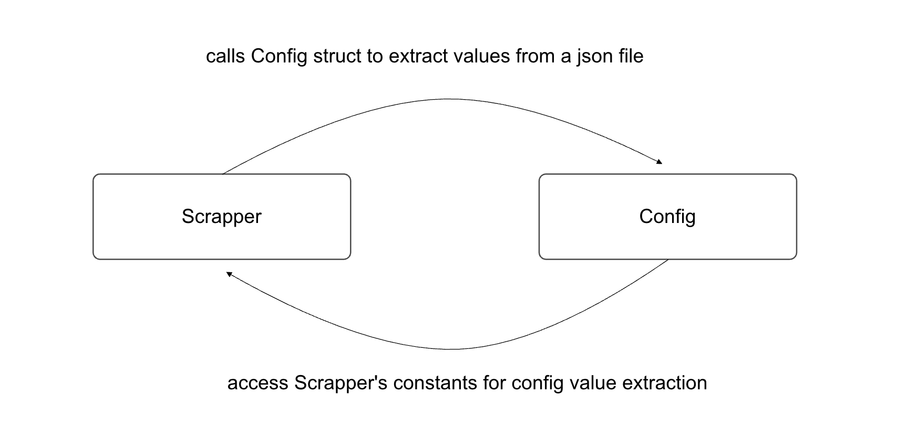
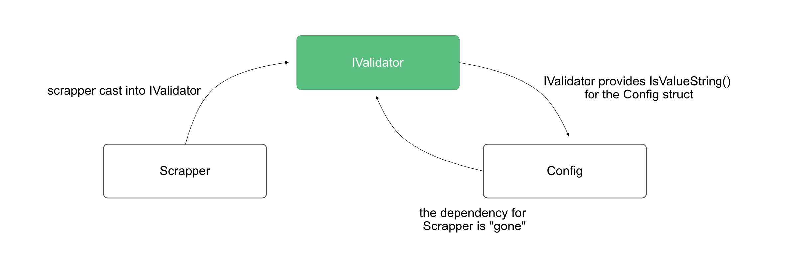

# Golang Gotchas - the curse of "cycle import"

## agenda
- ## starting with ... a single package working example
- ## a reason for refactoring into multiple package
  - ### initial design

- ### cycle import 
   - ### why and 
   - ### how to resolve

----

- ## a variation of the original design

- ### cycle import again 
   - ### why and 
   - ### how to resolve

